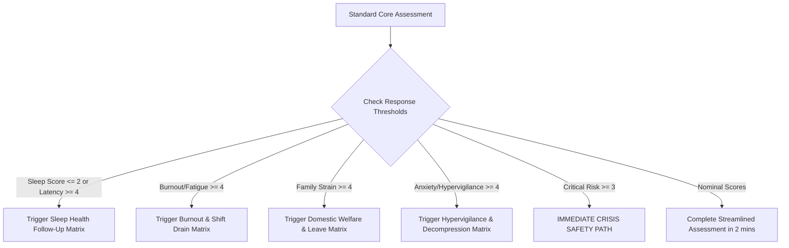

# AI-Powered Behavioral Self-Assessment Engine: Clinical & Psychometric Specification
## Uniformed Services Psychological Telemetry, Predictive Analytics & Early Welfare Detection System

---

## 1. Overall Assessment Architecture

The Behavioral Self-Assessment Engine is a non-diagnostic, predictive psychological telemetry system designed specifically for Armed Forces, Central Armed Police Forces (CAPF), state police, and tactical defense personnel operating in high-tempo, isolated, or combat-ready environments. 

Rather than serving as a static psychopathology screener, it functions as an **adaptive cognitive sensor** that models an individual's personal behavioral baseline, detects subtle behavioral drift over longitudinal timeframes, and computes multi-dimensional stress and burnout risk indices before clinical crisis manifests.

```
┌───────────────────────────────────────────────────────────────────────────────────────────────────┐
│                                   FRONT-LINE MOBILE TERMINAL                                      │
├────────────────────────────────┬──────────────────────────────────┬──────────────────────────────┤
│      LEVEL 1: DAILY PULSE      │     LEVEL 2: WEEKLY AUDIT        │   LEVEL 3: MONTHLY PROFILING │
│   (2–3 Mins • 10–15 Questions) │    (5 Mins • 35–45 Questions)    │  (10 Mins • 70–90 Questions) │
└────────────────────────────────┴──────────────────────────────────┴──────────────────────────────┘
                                                  │
                                                  ▼
┌───────────────────────────────────────────────────────────────────────────────────────────────────┐
│                              ADAPTIVE AI QUESTION ORCHESTRATION ENGINE                            │
│   • Dynamic Item Selection (Item Response Theory & Contextual Prompting)                          │
│   • Cognitive Burden Minimization (Skip Logic, Smart Branching & Non-Repetitive Phrasing)        │
│   • Early Risk Trigger Branching (Elevated Strain ➔ Deep Follow-Up; Emergency ➔ Crisis Safe-Path) │
└───────────────────────────────────────────────────────────────────────────────────────────────────┘
                                                  │
                                                  ▼
┌───────────────────────────────────────────────────────────────────────────────────────────────────┐
│                               MULTI-DIMENSIONAL SCORING & DIGITAL TWIN                            │
│   • Longitudinal Baseline Normalization (EWMA / Z-Score relative to individual baseline)          │
│   • Fusion with HRMS Telemetry (Duty Shift Cycles, Leave Gaps, Night Deployments, Screen Time)    │
│   • Behavioral Drift & Velocity Engine (CUSUM Change-Point Detection)                             │
└───────────────────────────────────────────────────────────────────────────────────────────────────┘
                                                  │
                                                  ▼
┌───────────────────────────────────────────────────────────────────────────────────────────────────┐
│                                EXPLAINABLE AI & INTERVENTION DISPATCH                             │
│   • Explainable Root-Cause Attribution (SHAP Decomposition: Sleep 38%, Shift 28%, Social 20%)     │
│   • Tiered Clinical Interventions (Micro-Pacing, Sleep Hygiene, Welfare Officer Debrief, Escalation)│
│   • Dual Closed-Loop Console (Frontline Soldier Insights + Secure Welfare Command Dashboard)      │
└───────────────────────────────────────────────────────────────────────────────────────────────────┘
```

### Multi-Level Temporal Hierarchy

| Level | Name | Frequency | Target Duration | Question Volume | Primary Objective |
| :--- | :--- | :--- | :--- | :--- | :--- |
| **Level 1** | **Daily Operational Pulse** | Daily (End-of-Shift / Morning Stand-to) | 2–3 Minutes | 10–15 Items | Detect acute transient swings in sleep latency, immediate emotional composure, physical fatigue, and acute shift friction. |
| **Level 2** | **Weekly Tactical Check-In** | Weekly (Sunday / Duty Rest Cycle) | 5 Minutes | 35–45 Items | Evaluate weekly cumulative fatigue, burnout markers, hypervigilance recovery, cognitive clarity, and family connectivity. |
| **Level 3** | **Monthly Deep Profile** | Monthly (Pay/Deployment Cycle) | 10 Minutes | 70–90 Items | Build and calibrate the soldier's long-term **Digital Psychological Twin**, calibrate resilience buffers, and monitor systemic behavioral drift. |

---

## 2. Psychological Domain Taxonomy (18 Clinical & Operational Domains)

Every item in the system maps to one of 18 validated military behavioral health constructs rewritten from first principles:

1. **Emotional Well-being (`EMO`)**: Emotional stability, mood equilibrium, composure under unexpected friction.
2. **Stress Perception (`STR`)**: Subjective burden, perceived coping bandwidth, and stress overload.
3. **Burnout & Exhaustion (`BUR`)**: Energy depletion, emotional exhaustion, cynicism, and sense of futility.
4. **Emotional Fatigue (`EMF`)**: Compassion fatigue, emotional blunting, and depletion of empathy for squad peers.
5. **Anxiety & Hypervigilance (`ANX`)**: Inability to down-regulate from tactical alertness, physical tension, and excessive worry.
6. **Depression Screening Markers (`DEP`)**: Anhedonia, loss of initiative, vegetative low mood, screening-only early warning signals.
7. **Sleep Health (`SLP`)**: Restorative sleep depth, insomnia, fragmented sleep, early waking, shift-change sleep debt.
8. **Physical Fatigue (`FAT`)**: Musculoskeletal strain, somatic heaviness, bodily exhaustion, physical recovery capacity.
9. **Cognitive Performance (`COG`)**: Mental focus, working memory sharpness, decision speed, absent-minded tactical errors.
10. **Operational Workload (`WRK`)**: Subjective shift intensity, consecutive duty hours, task overwhelm, lack of rest intervals.
11. **Family Well-being (`FAM`)**: Domestic peace of mind, family health distress, financial friction, distant parental strain.
12. **Social Connectedness (`SOC`)**: Squad camaraderie, perceived isolation, feeling unsupported by peers or commanders.
13. **Resilience (`RES`)**: Psychological bounce-back velocity after high-stress missions or disciplinary friction.
14. **Motivation & Purpose (`MOT`)**: Pride in uniform, mission clarity, vocational satisfaction, dedication to unit readiness.
15. **Behavioral Changes (`BEH`)**: Self-reported irritability, sudden social withdrawal, altered eating habits, temper flares.
16. **Welfare Concerns (`WEL`)**: Housing issues, food/ration satisfaction, leave clearance distress, medical administrative friction.
17. **Critical Risk Trigger (`CRI`)**: Despair, feelings of being trapped, severe hopelessness (triggers non-punitive crisis triage).
18. **Positive Psychology (`POS`)**: Gratitude, optimism, personal growth, sense of meaning, spiritual groundedness.

---

## 3. Question Design Principles & Standardized Psychometric Scale

### Psychometric Standard
- **Uniform Response Scale**: Every item across all 3 levels utilizes the exact same 5-point Likert scale:
  1. **Never** (Value = 1)
  2. **Rarely** (Value = 2)
  3. **Sometimes** (Value = 3)
  4. **Often** (Value = 4)
  5. **Almost Always** (Value = 5)
- **Timeframe Anchor**:
  - Daily: *"During the last 24 hours / your duty shift..."*
  - Weekly: *"Over the past 7 days..."*
  - Monthly: *"Over the past 30 days..."*
- **Linguistic Constraints**:
  - Max word count: **20 words**. Ideal length: **8–14 words**.
  - No clinical jargon (e.g., no "depressive episodes", "panic disorder", "pathology").
  - Dignified, military-appropriate, non-judgmental wording that builds trust with combatants and officers alike.

---

## 4. Master Question Bank & Comprehensive Metadata Matrix

```
Metadata Schema:
- Question ID: Unique hierarchical identifier (e.g., L1-EMO-01)
- Level: Daily (L1) / Weekly (L2) / Monthly (L3)
- Domain & Sub-domain: Clinical classification
- Question Text: The exact prompt presented on mobile screen
- Psychological Construct: The specific cognitive/affective variable measured
- Risk Direction: Positive (+ wellness) or Negative (- distress)
- Reverse Scored: True/False
- Weight: Importance multiplier (0.8 - 1.5)
- Prediction Targets: Array of AI output vectors impacted
- Trigger Condition: When dynamic follow-up is prompted
```

### 4.1 Level 1: Daily Operational Pulse (15 Items)

| Question ID | Domain | Sub-domain | Question Text | Reverse Scored | Weight | AI Prediction Targets | Trigger Condition |
| :--- | :--- | :--- | :--- | :--- | :--- | :--- | :--- |
| **L1-SLP-01** | Sleep Health | Sleep Depth | My sleep last night left me feeling physically restored for duty. | No | 1.4 | `Sleep Score`, `Burnout Score`, `Operational Readiness` | Score <= 2 (Rarely/Never) |
| **L1-SLP-02** | Sleep Health | Sleep Latency | I found it difficult to quiet my thoughts and fall asleep. | Yes | 1.2 | `Sleep Score`, `Anxiety Risk`, `Stress Score` | Score >= 4 (Often/Almost Always) |
| **L1-EMO-01** | Emotional Well-being | Composure | I felt steady and in control of my emotions during my shift. | No | 1.1 | `Overall Wellness`, `Emotional Fatigue`, `Resilience` | Score <= 2 |
| **L1-STR-01** | Stress Perception | Acute Strain | The operational pressure today felt heavier than I could easily handle. | Yes | 1.3 | `Stress Score`, `Intervention Need`, `Welfare Concern` | Score >= 4 |
| **L1-FAT-01** | Physical Fatigue | Somatic Heaviness | My body felt heavy or drained of physical stamina today. | Yes | 1.1 | `Operational Readiness`, `Burnout Score`, `Sleep Score` | Score >= 4 |
| **L1-COG-01** | Cognitive Performance | Focus | I maintained sharp attention without making absent-minded mistakes on duty. | No | 1.2 | `Operational Readiness`, `Cognitive Fatigue`, `Stress Score` | Score <= 2 |
| **L1-ANX-01** | Anxiety | Tactical Unwinding | Once off-duty, my mind remained tense or on high alert. | Yes | 1.2 | `Anxiety Risk`, `Sleep Score`, `Emotional Fatigue` | Score >= 4 |
| **L1-WRK-01** | Operational Workload | Shift Pace | The pace of work today allowed adequate time to catch my breath. | No | 1.0 | `Workload Pressure`, `Burnout Score`, `Stress Score` | Score <= 2 |
| **L1-SOC-01** | Social Connectedness | Peer Support | I felt supported by my squad mates during today's duties. | No | 1.0 | `Social Isolation`, `Resilience`, `Welfare Concern` | Score <= 2 |
| **L1-MOT-01** | Motivation & Purpose | Task Drive | I felt genuine energy and motivation for my daily tasks. | No | 1.1 | `Motivation`, `Depression Screening`, `Burnout Score` | Score <= 2 |
| **L1-BEH-01** | Behavioral Changes | Irritability | Small routine annoyances caused me to feel unusually irritable today. | Yes | 1.2 | `Behavioral Change`, `Emotional Fatigue`, `Stress Score` | Score >= 4 |
| **L1-FAM-01** | Family Well-being | Home Peace | Worry about matters back home distracted me from my tasks today. | Yes | 1.1 | `Family Stress`, `Welfare Concern`, `Cognitive Fatigue` | Score >= 4 |
| **L1-RES-01** | Resilience | Adaptability | When duty plans changed abruptly, I adapted without losing focus. | No | 1.0 | `Resilience`, `Operational Readiness`, `Stress Score` | Score <= 2 |
| **L1-WEL-01** | Welfare Concerns | Basic Amenities | My meals, hydration, and rest environment were adequate today. | No | 1.0 | `Welfare Concern`, `Operational Readiness`, `Burnout Score` | Score <= 2 |
| **L1-POS-01** | Positive Psychology | Day End Gratitude | I found satisfaction or humor in at least one moment today. | No | 0.9 | `Overall Wellness`, `Depression Screening`, `Resilience` | Score <= 2 |

---

### 4.2 Level 2: Weekly Tactical Check-In (Core Items Sample)

| Question ID | Domain | Sub-domain | Question Text | Reverse Scored | Weight | AI Prediction Targets | Trigger Condition |
| :--- | :--- | :--- | :--- | :--- | :--- | :--- | :--- |
| **L2-BUR-01** | Burnout | Exhaustion | I felt completely wiped out mentally before my duty week even started. | Yes | 1.4 | `Burnout Score`, `Emotional Fatigue`, `Intervention Need` | Score >= 4 |
| **L2-BUR-02** | Burnout | Cynicism | I feel increasingly detached from the value of my everyday duties. | Yes | 1.3 | `Burnout Score`, `Motivation`, `Behavioral Change` | Score >= 4 |
| **L2-EMF-01** | Emotional Fatigue | Empathy Drain | Listening to comrades' problems feels exhausting rather than supportive. | Yes | 1.2 | `Emotional Fatigue`, `Burnout Score`, `Social Isolation` | Score >= 4 |
| **L2-DEP-01** | Depression Screening | Anhedonia | Things that usually give me pleasure felt dull and unrewarding this week. | Yes | 1.4 | `Depression Screening`, `Overall Wellness`, `Intervention Need` | Score >= 4 |
| **L2-DEP-02** | Depression Screening | Morning Low | Waking up to face the day required extraordinary willpower this week. | Yes | 1.3 | `Depression Screening`, `Burnout Score`, `Motivation` | Score >= 4 |
| **L2-ANX-02** | Anxiety | Somatic Tension | I noticed physical tension like clenched jaws, headaches, or tight shoulders. | Yes | 1.1 | `Anxiety Risk`, `Stress Score`, `Sleep Score` | Score >= 4 |
| **L2-COG-02** | Cognitive Performance | Decision Speed | Making simple decisions required noticeably more effort than usual this week. | Yes | 1.2 | `Cognitive Fatigue`, `Operational Readiness`, `Burnout Score` | Score >= 4 |
| **L2-WRK-02** | Operational Workload | Recovery Gaps | Duty rotations left me with sufficient time to physically and mentally recover. | No | 1.3 | `Workload Pressure`, `Burnout Score`, `Operational Readiness` | Score <= 2 |
| **L2-FAM-02** | Family Well-being | Distance Burden | Distance from family felt like an unmanageable burden over the past week. | Yes | 1.2 | `Family Stress`, `Welfare Concern`, `Emotional Fatigue` | Score >= 4 |
| **L2-SOC-02** | Social Connectedness | Unit Trust | I trust that my leadership actively looks out for our unit's welfare. | No | 1.2 | `Welfare Concern`, `Social Isolation`, `Motivation` | Score <= 2 |
| **L2-RES-02** | Resilience | Coping Rebound | When faced with setbacks this week, I bounced back with steady morale. | No | 1.1 | `Resilience`, `Overall Wellness`, `Operational Readiness` | Score <= 2 |
| **L2-BEH-02** | Behavioral Changes | Social Withdrawal | I found myself avoiding meals or conversations with fellow soldiers. | Yes | 1.3 | `Behavioral Change`, `Social Isolation`, `Depression Screening` | Score >= 4 |
| **L2-WEL-02** | Welfare Concerns | Administrative Friction | Administrative hurdles or leave uncertainties caused noticeable stress this week. | Yes | 1.2 | `Welfare Concern`, `Stress Score`, `Family Stress` | Score >= 4 |
| **L2-POS-02** | Positive Psychology | Purpose Alignment | I feel strong pride in representing my unit and wearing this uniform. | No | 1.0 | `Motivation`, `Overall Wellness`, `Resilience` | Score <= 2 |
| **L2-CRI-01** | Critical Risk | Overwhelm Point | Over the past week, life felt so overwhelming that I struggled to keep going. | Yes | 2.0 | `Critical Risk`, `Intervention Need`, `Escalation Flag` | Score >= 3 |

---

### 4.3 Level 3: Monthly Deep Profiling Items (Psychological Twin Calibration)

| Question ID | Domain | Sub-domain | Question Text | Reverse Scored | Weight | AI Prediction Targets |
| :--- | :--- | :--- | :--- | :--- | :--- | :--- |
| **L3-EMO-03** | Emotional Well-being | Mood Regulation | Over the past month, my mood has remained consistent and predictable. | No | 1.1 | `Digital Twin Baseline`, `Emotional Fatigue` |
| **L3-STR-04** | Stress Perception | Chronic Stress Load | High stress has become my constant baseline rather than an occasional event. | Yes | 1.4 | `Stress Score`, `Burnout Score`, `Digital Twin Drift` |
| **L3-BUR-05** | Burnout | Professional Inefficacy | I feel that my operational contributions make a meaningful difference to our mission. | No | 1.3 | `Burnout Score`, `Motivation`, `Digital Twin Baseline` |
| **L3-SLP-05** | Sleep Health | Circadian Recovery | Even after rest days, I feel tired and unrefreshed. | Yes | 1.4 | `Sleep Score`, `Burnout Score`, `Digital Twin Drift` |
| **L3-FAM-04** | Family Well-being | Long-term Stability | Family arrangements, healthcare, and schooling are in a secure state. | No | 1.2 | `Family Stress`, `Welfare Concern`, `Digital Twin Baseline` |
| **L3-SOC-04** | Social Connectedness | Unit Brotherhood | If I faced a personal crisis, multiple colleagues here would readily support me. | No | 1.3 | `Social Isolation`, `Resilience`, `Welfare Concern` |
| **L3-MOT-04** | Motivation & Purpose | Long-term Dedication | I see a clear, positive path forward in my service career. | No | 1.2 | `Motivation`, `Depression Screening`, `Digital Twin Baseline` |
| **L3-WEL-05** | Welfare Concerns | Family Welfare Support | Unit welfare channels have addressed my domestic or leave requests fairly. | No | 1.2 | `Welfare Concern`, `Welfare Officer Action` |
| **L3-CRI-02** | Critical Risk | Hopelessness Depth | I felt a deep sense of hopelessness about my future during this month. | Yes | 2.0 | `Critical Risk`, `Emergency Triage`, `Escalation Need` |

---

## 5. Adaptive Follow-Up Rules & Dynamic Branching Engine

The AI uses a **Finite-State Branching Matrix** triggered by real-time item threshold breaches:



### Adaptive Rule Matrix

1. **Sleep Risk Branch**:
   - *Trigger*: `L1-SLP-01` <= 2 OR `L1-SLP-02` >= 4
   - *Follow-up Items*:
     - `AD-SLP-01`: *"Are frequent night shifts or barracks noise disrupting your sleep cycles?"*
     - `AD-SLP-02`: *"Do you find yourself waking up multiple times gasping or startled?"*
   - *Conversational AI Prompt*: *"I noticed your rest has been disrupted. Would you like a 3-minute guided sleep decompression protocol?"*

2. **Burnout & Workload Branch**:
   - *Trigger*: `L2-BUR-01` >= 4 OR `L1-WRK-01` <= 2
   - *Follow-up Items*:
     - `AD-BUR-01`: *"Have you had at least 24 hours of uninterrupted rest in the past 10 days?"*
     - `AD-BUR-02`: *"Do you feel physically numb or emotionally detached while carrying out duties?"*

3. **Family & Domestic Strain Branch**:
   - *Trigger*: `L1-FAM-01` >= 4 OR `L2-FAM-02` >= 4
   - *Follow-up Items*:
     - `AD-FAM-01`: *"Is there an unresolved medical, legal, or financial emergency at home right now?"*
     - `AD-FAM-02`: *"Are communication network limitations preventing you from speaking to family?"*

4. **Emergency Crisis Protocol (Non-Punitive Safe Mode)**:
   - *Trigger*: `L2-CRI-01` >= 3 OR `L3-CRI-02` >= 3
   - *Action*:
     - Immediately stop standard questions.
     - Switch UI to a comforting, secure, private support portal.
     - Provide 1-tap encrypted direct connect to Welfare Counselor (non-punitive, completely confidential).
     - Flag Welfare Officer console with a high-priority proactive outreach tag without exposing stigmatizing diagnostic labels.

---

## 6. Multi-Dimensional AI Scoring Logic

Every domain score $S_d \in [0, 100]$ is computed where **100 represents optimal operational wellness**:

$$S_d = \frac{1}{\sum w_i} \sum_{i \in d} w_i \cdot \text{Normalized}(R_i)$$

Where normalized response $R_i \in [0, 100]$:
- Standard Items: $\text{Normalized}(R_i) = (R_i - 1) \times 25$
- Reverse-Scored Items: $\text{Normalized}(R_i) = (5 - R_i) \times 25$

### Composite Predictive Indices

$$\text{Overall Wellness Index} = \sum_{d=1}^{18} \alpha_d \cdot S_d$$

$$\text{Predictive Stress Index} = 100 - \left( 0.40 \cdot S_{\text{STR}} + 0.30 \cdot S_{\text{WRK}} + 0.15 \cdot S_{\text{ANX}} + 0.15 \cdot S_{\text{SLP}} \right)$$

$$\text{Predictive Burnout Score} = 100 - \left( 0.45 \cdot S_{\text{BUR}} + 0.25 \cdot S_{\text{EMF}} + 0.15 \cdot S_{\text{FAT}} + 0.15 \cdot S_{\text{MOT}} \right)$$

$$\text{Operational Readiness Index} = 0.30 \cdot S_{\text{COG}} + 0.25 \cdot S_{\text{RES}} + 0.20 \cdot S_{\text{SLP}} + 0.15 \cdot S_{\text{FAT}} + 0.10 \cdot S_{\text{MOT}}$$

---

## 7. Intervention Mapping & Escalation Protocol

| Risk Level | Composite Score Range | Recommended Interventions | Reason & Clinical Rationale | Welfare Officer Action | Escalation Priority |
| :--- | :--- | :--- | :--- | :--- | :--- |
| **Low / Nominal** | Overall > 75; Stress < 45; Burnout < 40 | Routine duty maintenance; squad wellness check-ins; digital self-care modules. | Balanced autonomic state; adequate sleep and coping buffers intact. | Monitor passive weekly trends; maintain regular camaraderie activities. | **P4 (Routine)** |
| **Moderate** | Overall 60–75; Stress 45–65; Burnout 40–60 | Structured sleep hygiene pacing; mobile micro-decompression exercises; peer buddy review. | Early signs of shift fatigue or domestic distraction; risk of compounding strain. | Discreetly inquire about sleep conditions or family leave queues during rounds. | **P3 (Watchlist)** |
| **High** | Overall 45–60; Stress 65–80; Burnout 60–80 | 24–48h shift duty rotation adjustment; informal 1-on-1 Welfare Officer debrief; peer mentor pairing. | Multi-domain strain across sleep, cognition, and emotional composure; elevated error risk. | Schedule structured supportive interview within 48 hours; review leave status. | **P2 (High Priority)** |
| **Critical** | Overall < 45; Stress > 80; Burnout > 80; Crisis Flag | Immediate operational stand-down from high-risk duty; clinical counseling consult; family welfare assist. | Severe emotional exhaustion, profound sleep deficit, or acute distress. | Immediate in-person welfare contact within 6 hours; confidential psychological review. | **P1 (Immediate Action)** |

---

## 8. Digital Psychological Twin (Longitudinal Baselining)

Traditional assessments compare soldiers against generic population averages. The **Digital Psychological Twin** models each soldier's personal baseline $(\mu_{d}, \sigma_{d})$ over a rolling 60-day calibration window.

```
Individual Baseline Model (Digital Twin):
  • Sleep Equilibrium: 5.8h - 6.5h
  • Standard Stress Tolerance: S_STR ~ 68/100
  • Recovery Velocity: 36 hours post-patrol
```

### Baselining Formulations:
- **Baseline Mean**: $\mu_{d}(t) = \lambda \mu_{d}(t-1) + (1-\lambda) S_{d}(t)$, where $\lambda = 0.92$
- **Personal Z-Score Divergence**: 
  $$Z_d(t) = \frac{S_d(t) - \mu_d(t)}{\sigma_d(t)}$$
- A score drop of 15 points in an individual who consistently operates at 85 is flagged as a high-risk drift, even though the raw score (70) appears "Moderate" on population charts.

---

## 9. Behavioral Drift Detection Strategy

To identify insidious burnout and cumulative operational fatigue developing over weeks and months, the system implements **CUSUM (Cumulative Sum Control Chart)** and **EWMA (Exponentially Weighted Moving Average)** change-point algorithms:

$$\text{CUSUM}_{t}^{+} = \max\left(0, \text{CUSUM}_{t-1}^{+} + \frac{\mu_{d} - S_{d}(t)}{\sigma_d} - k\right)$$

- When $\text{CUSUM}_{t}^{+} > h$ (decision threshold $h = 4.5$), the system triggers a **"Chronic Behavioral Drift Warning"** on the Welfare Officer console.
- Identifies:
  1. Gradual sleep quality degradation over 4 consecutive weeks.
  2. Slow withdrawal from peer interactions.
  3. Incremental erosion of vocational motivation following prolonged deployment.

---

## 10. Explainable AI (XAI) Attribution Architecture

Every risk prediction is decomposed into human-interpretable risk attribution factors using game-theoretic Shapley-value approximations:

$$\text{Risk Factor Contribution } C_k = \frac{|\phi_k|}{\sum_{j} |\phi_j|} \times 100\%$$

### Example Officer Output Card:
```
Personnel: Sepoy Amit Kumar (UID-SLD-015)
Calculated Stress Score: 78 / 100 [HIGH RISK]
Confidence Score: 95.4%

Primary Explanatory Contributors:
├── 38% : Sleep Deficit (<4.5h continuous sleep over 4 nights)
├── 28% : Operational Workload (8 consecutive night surveillance shifts)
├── 20% : Family Separation Friction (unresolved domestic distress)
└── 14% : Cognitive Fatigue Accumulation

Actionable Welfare Guidance:
"Target 48h shift rotation to daytime duties and facilitate secure tele-connect with family."
```

---

## 11. Multilingual & Mobile Human Factors UX Guidelines

1. **Low-Cognitive Load Interaction**:
   - Maximum 1 question per screen on mobile.
   - Large, tactile thumb-friendly Likert tap targets (min 48dp).
   - High-contrast visual progression bar.
2. **Native Language Localization**:
   - Full bilingual support (English, Hindi, Punjabi, Bengali, Marathi, Tamil, Telugu, etc.).
   - Culturally respectful idioms tailored to military pride and ethos (*Josh*, *Seva*, *Biradari*).
3. **Offline Telemetry Buffer**:
   - Zero connectivity required: assessments are encrypted locally with AES-256 and synced seamlessly upon returning to gateway coverage.

---

## 12. Future Expansion Roadmap

1. **Acoustic Voice Stress Biomarkers**: Non-intrusive micro-tremor voice analysis during mandatory duty check-in acknowledgments.
2. **Wearable HRV Autonomic Fusion**: Real-time integration of resting Heart Rate Variability (HRV RMSSD) to validate self-reported sleep quality.
3. **Natural Language Free-Text Sentiment Mirroring**: Optional 1-sentence open audio/text journal analyzed with on-device BERT NLP sentiment extractors.